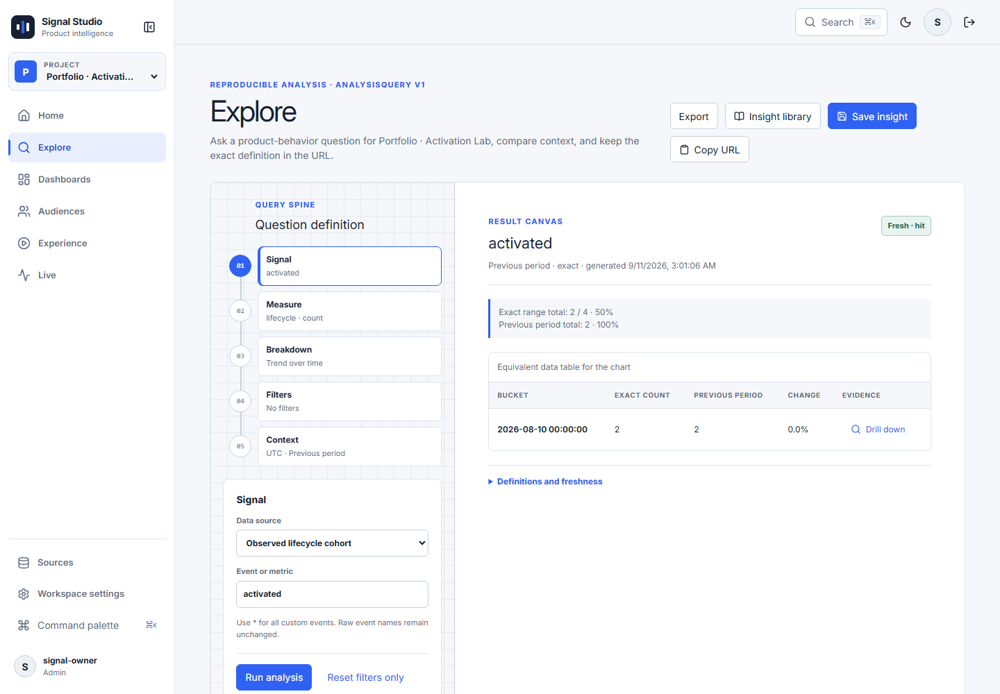

# Signal Studio

[](https://github.com/godaylor/signal-studio/actions/workflows/ci.yml)

**Turn product events into answers your team can reuse.** Signal Studio is a
self-hosted product intelligence workspace for activation, retention and feature
adoption. Connect a source, explore behavior, save an Insight, build a Dashboard,
inspect an Audience and export the results.

This is a working full-stack application with PostgreSQL persistence, authenticated
APIs and background jobs. Production runs on **Vercel Hobby + Neon Free ($0 within
quotas)**, with encrypted PostgreSQL exports, request-triggered jobs and scheduled recovery.

**[Try the public demo — no login](https://signal-studio-smoky.vercel.app/demo)** ·
[Sign in to a real workspace](https://signal-studio-smoky.vercel.app/login)

The public demo is an interactive walkthrough on clearly labeled fictional data;
its saved state resets on reload. Real sources, ingestion, analyses and exports
use authenticated workspaces. No shared administrator credentials are provided.
See [free deployment](docs/FREE_DEPLOYMENT.md) and
[production acceptance evidence](docs/PRODUCTION_ACCEPTANCE_2026-09-23.md).



Screenshots show the actual application running against explicitly synthetic
portfolio data. They are not mock interfaces or production traffic.

## What works

- **Source onboarding:** create a project, copy its tracker snippet, instrument
  meaningful events and verify ingestion without leaving Studio.
- **Explore and Query Spine:** reproducible URL queries, exact PostgreSQL event
  counts, six breakdown dimensions, filters, comparison, funnels and retention.
- **Insights and Dashboards:** save, reopen, search, duplicate and organize analyses;
  dashboard widgets reference Insights and share compatible query results.
- **Audiences and evidence:** user/account identity, saved segments and cohorts,
  session timelines, Web Vitals and replay where recorded.
- **Live:** a timestamped snapshot, pause/resume, visibility-aware polling and
  preserved results during connection failures.
- **Exports:** scoped CSV/JSON, queued large exports, expiring artifacts and
  authorization checked again before download.
- **Team security:** role/capability enforcement, 2FA policy, session revocation,
  login throttling, aggregate-only expiring and revocable public shares.
- **Operations:** dependency-aware readiness, structured telemetry, retention/
  deletion jobs, RU/EN interfaces and accessible keyboard workflows.

Public self-registration, billing, alerts/notifications, governed event catalog,
entity command search and personal recents/favorites are not shipped features.
ClickHouse parity is not claimed. [Requirement boundaries](docs/REQUIREMENTS_TRACEABILITY.md).

## Architecture and stack

```text
Tracked product → tracker / ingestion API → PostgreSQL
                                             ↑
Browser → Next.js UI → authenticated services → analytics / saved entities
                                             ↑
                            export + retention worker → durable artifacts
```

| Layer | Actual technology |
|---|---|
| UI | React 19, Next.js 16 App Router, TypeScript 6, CSS Modules, Inter |
| Client state | TanStack Query 5, versioned URL codec, Zustand for existing app preferences |
| UI/visualization | Chart.js, Lucide, Motion, react-window, @umami/react-zen |
| Server | Next.js route handlers, Zod 4, reusable permission/domain services |
| Data | PostgreSQL 15+, Prisma 7 with the PostgreSQL adapter, parameterized analytical SQL |
| Authentication | bcryptjs, signed typed JWTs, session versions, encrypted TOTP secrets |
| Collection/experience | Compatible Umami tracker/ingestion, rrweb recording/player, Web Vitals |
| Jobs/storage | PostgreSQL leases and bounded encrypted artifacts; request-triggered Node jobs and GitHub Actions recovery, or local worker/files for self-hosting |
| Delivery | Node 22.22.2, pnpm 10.15.1, Docker multi-stage images, GitHub Actions |
| Verification | Vitest, Testing Library, Playwright Chromium, axe, PostgreSQL golden fixtures |

Redis, ClickHouse and Kafka packages remain inherited optional infrastructure;
they are not needed by the supported PostgreSQL deployment. Exact dependencies,
versions and licenses are in `package.json`, `pnpm-lock.yaml` and the generated SBOM.

[Architecture](docs/ARCHITECTURE.md) · [Code origins and contribution](docs/CODE_ORIGINS.md)

## Run locally

Required: Node **22.22.x** (pinned **22.22.2**), pnpm **10.15.1**, Docker Compose.
The local app and database bind only to `127.0.0.1:32109` and `127.0.0.1:32110`.
If those ports are occupied, set the project-specific port variables; do not stop
another project's processes.

```bash
corepack enable
corepack prepare pnpm@10.15.1 --activate
pnpm install --frozen-lockfile
pnpm env:init
docker compose up -d db
pnpm db:migrate
pnpm admin:bootstrap --local
pnpm build
pnpm start
```

In a second terminal, run `pnpm worker:exports`. Open
[local Signal Studio](http://127.0.0.1:32109). Administrator credentials are created
in `.local/credentials/administrator.json`, never printed or committed. The old
`admin / umami` credential is disabled. Create a project in Studio and follow
**Sources** to collect actual events.

Optional synthetic portfolio data: `pnpm db:seed` followed by
`pnpm db:seed:portfolio`. These commands are explicit and never run on startup.

Alternatively, after generating configuration, run `docker compose up -d --build`.
Compose uses this checkout's app/worker/migration images and project-specific
volumes. Keep the database data and export volumes when upgrading.

On Windows, `scripts/setup-runtime.ps1` installs the pinned Node runtime locally;
`scripts/pnpm.ps1` runs commands through it.

## Configuration and deployment

`pnpm env:init` generates independent secrets and refuses to overwrite an existing
`.env`. Do not copy placeholder secrets from `.env.example`.

| Variable | Purpose |
|---|---|
| `DATABASE_URL` | PostgreSQL connection; private database host in production |
| `APP_SECRET` | Independent signing secret of at least 32 characters |
| `TWO_FACTOR_ENCRYPTION_KEY` | Random 32-byte key as 64 hexadecimal characters |
| `EXPORT_STORAGE_PATH` | Durable directory shared by app and worker |
| `SIGNAL_STUDIO_PUBLIC_URL` | Public HTTPS origin |
| `SIGNAL_STUDIO_BIND_HOST`, `PORT` | Native bind address and app port |
| `SIGNAL_STUDIO_APP_PORT`, `SIGNAL_STUDIO_DB_PORT` | Local Compose port overrides |

Additional variables are documented in [.env.example](.env.example).
GeoLite2 is skipped unless the operator explicitly provides a licensed dataset.
Never disable TLS verification to solve a production database connection problem.

**Current portfolio deployment:** Vercel Hobby + Supabase Free, with no paid
resources. `pnpm build:vercel` builds the Node application; request-triggered jobs
and Supabase Cron replace the persistent worker, and encrypted artifacts live in
private Supabase Storage. Migrations remain an explicit operator step. The Docker
`hosted`, `runner`, `worker` and `migration` targets remain available for self-hosting.

[Free hosting configuration, quotas and first-administrator setup](docs/FREE_DEPLOYMENT.md).
A hosting account must be connected before the public release can be verified.

## Verification

```bash
pnpm typecheck
pnpm typecheck:e2e
pnpm lint
pnpm test
pnpm exec vitest run --config vitest.studio.config.ts
pnpm test:integration
pnpm build
pnpm exec playwright install chromium
pnpm test:e2e
```

Integration and release E2E use a separately migrated database whose name contains
`_test_`, with separate bootstrap credentials. See CI for the complete reproducible
sequence. `pnpm lint` is read-only; `pnpm check` writes fixes.

CI covers exact source builds, types, lint, unit/component/integration tests,
critical Chromium workflows, accessibility, readiness and non-root/legal image
packaging. Publishing release images requires the same CI to pass first.

## Ownership and open source

Signal Studio is an **MIT-licensed transformation of Umami 3.3.1**, not a claim that
all code was written from scratch. The original Umami copyright and complete MIT
notice remain intact in [LICENSE](LICENSE).

The project-specific contribution is the product model and Studio workflow,
Query Spine and URL contract, Insight/Dashboard/Audience services, account identity,
independent Studio analytics, permission/security hardening, export/retention jobs,
source onboarding, release tooling and verified deployment architecture.

Studio's event-count executor is independently implemented in
`src/server/analytics/adapters/event-postgresql.ts`; the normal Studio query path
no longer calls legacy Umami SQL. Compatible collection, legacy reports/settings,
authentication infrastructure and some UI components still retain upstream code.
Read [CODE_ORIGINS](docs/CODE_ORIGINS.md) before describing the project as independent.

[Third-party notices](THIRD_PARTY_NOTICES.md) cover fonts, icons, maps, replay,
UI libraries and dependencies. Distribution images include full notices, an
application SBOM and source/artifact fingerprints. No new media dependency was
introduced for this release.

[Portfolio handoff](PORTFOLIO_HANDOFF.md) · [Release evidence](docs/PRODUCT_RELEASE.md)
